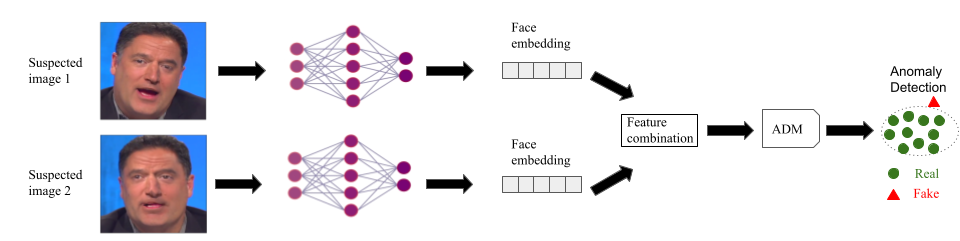

# DiffFake: Exposing Deepfakes using Differential Anomaly Detection



Official code of the WACVW 2025 paper: DiffFake: Exposing Deepfakes using Differential Anomaly Detection

# Setup

## 1) Downloading video datasets

Download the datasets and place them in `./Data/` according to data.md

## 2) Extracting video frames, facial landmarks and bounding boxes

To extract a specific number of frames from a given video dataset (e.g. FF++ original sequences) run the following:

```bash
python extract_frames.py \
--data_dir_path Data \
--dataset FF_original
```

To extract the facial landmarks and bounding boxes:
1) Download the face detector haarcascade_frontalface_alt2.xml from [here](https://github.com/mitre/biqt-face/blob/master/config/haarcascades/haarcascade_frontalface_alt2.xml) and place it in `./face_detectors`

2) Download the landmark detector lbfmodel.yaml from [here](https://github.com/kurnianggoro/GSOC2017/blob/master/data/lbfmodel.yaml) and place it in `./face_detectors`

3) First do `pip install opencv-contrib-python==4.11.0.86` ,then run the script (e.g.for FF++ original sequences):

```bash
python extract_bb_and_fl.py \
--data_dir_path Data \
--dataset FF_original
```


# Training the model

## 1) Training the backbone

To train an efficientnet-b4 as the backbone for DiffFake run the following script:

```bash
python train.py \
--data_dir_path Data \
--log_interval 200 \
--backbone efficientnet
```

## 2) Training the anomaly detection model (ADM)

To train a GMM as the ADM of DiffFake run the following script:

```bash
python train_AD_module.py \
--data_dir_path Data \
--model_dir {saved_backbone_path} \
--feature_combination 2 \
--ADM GMM \
--backbone efficientnet 
```


